# flamegraphs

An OCaml library for programmatically constructing flamegraphs and exporting them to SVG or folded stacks format.

## Features

- **Zero runtime dependencies** - uses only the OCaml standard library
- **Interactive SVG output** - click-to-zoom, search highlighting, hover tooltips
- **Folded stacks format** - import/export compatible with [flamegraph.pl](https://github.com/brendangregg/FlameGraph)
- **Flexible construction APIs** - build from stack traces or tree structures
- **Customizable rendering** - multiple color schemes, configurable dimensions

## Installation

(Not published on opam yet!)
```
opam install flamegraphs
```

## Quick Start

```ocaml
open Flamegraphs

(* Build a flamegraph using the tree API *)
let fg =
  Flamegraph.(of_tree
    (node "main" ~weight:0.0 [
      node "init" ~weight:30.0 [];
      node "process" ~weight:0.0 [
        node "parse" ~weight:100.0 [];
        node "compute" ~weight:150.0 [];
      ];
      node "cleanup" ~weight:70.0 [];
    ]))

(* Render to SVG *)
let () =
  match Svg.to_file "profile.svg" fg with
  | Ok () -> print_endline "Wrote profile.svg"
  | Error msg -> prerr_endline msg
```

The above code yields the following svg file ([raw interactive version](https://raw.githubusercontent.com/giltho/ocaml-flamegraphs/refs/heads/main/doc/assets/profile.svg)):



## API Overview

### Building Flamegraphs

#### Tree-based API (recommended for programmatic construction)

```ocaml
open Flamegraphs.Flamegraph

(* Create nodes with name, self-weight, and children *)
let tree =
  node "main" ~weight:0.0 [
    node "foo" ~weight:50.0 [];
    node "bar" ~weight:100.0 [
      node "baz" ~weight:25.0 [];
    ];
  ]

let fg = of_tree tree

(* Multiple roots *)
let fg = of_trees [tree1; tree2]
```

#### Stack-based API

```ocaml
open Flamegraphs.Flamegraph

(* From string lists *)
let stacks = [
  stack_of_strings ["main"; "process"; "compute"] ~weight:150.0;
  stack_of_strings ["main"; "process"; "parse"] ~weight:100.0;
  stack_of_strings ["main"; "init"] ~weight:30.0;
]
let fg = of_stacks stacks

(* With metadata *)
let stacks = [
  stack [
    frame "main" ~metadata:[("file", "main.ml"); ("line", "10")];
    frame "process";
    frame "compute";
  ] ~weight:150.0;
]
```

### SVG Rendering

```ocaml
open Flamegraphs

(* Default configuration *)
let svg = Svg.to_string fg

(* Custom configuration *)
let config = Svg.config
  ~width:1600
  ~title:"CPU Profile"
  ~color_scheme:Svg.Hot
  ()

let svg = Svg.to_string ~config fg

(* Write to file *)
let result = Svg.to_file ~config "output.svg" fg
```

#### Color Schemes

- `Hot` - Red-orange-yellow gradient (CPU profiles)
- `Cold` - Blue-cyan gradient (off-CPU/IO profiles)
- `Memory` - Green gradient (memory allocation)
- `Io` - Purple gradient (IO profiles)
- `Custom f` - User-provided coloring function

### Folded Stacks Format

Compatible with Brendan Gregg's flamegraph.pl tool.

```ocaml
open Flamegraphs

(* Export *)
let folded = Folded.to_string fg
(* Output:
   main;init 30.00
   main;process;parse 100.00
   main;process;compute 150.00
   main;cleanup 70.00
*)

(* Import *)
let fg = Folded.of_file "profile.folded"

(* Custom separator and weight format *)
let config = Folded.config ~separator:"->" ~weight_format:Folded.Integer ()
let folded = Folded.to_string ~config fg
```

## Interactive SVG Features

The generated SVG includes JavaScript for:

- **Click** on a frame to zoom in
- **Right-click** or click "Reset Zoom" to reset view
- **Search box** to highlight matching frames (supports substrings)
- **Hover** to see frame details and timing

## License

BSD-3-Clause. See [LICENSE](LICENSE) for details.

## AI Disclaimer

This library was built with heavy use of AI.